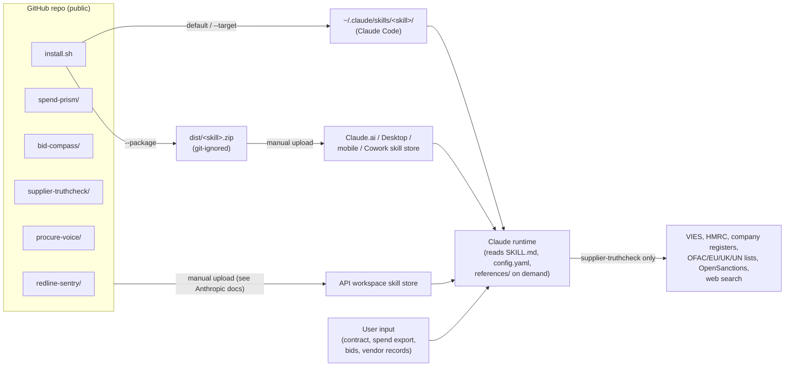

# Architecture: procurement-skills

This repo has no server, database or build step. The "system" is a set of skill folders, a shell installer, and the Claude runtime that loads them. Architecture here means how skills are packaged, distributed and executed.

## 1. System overview

The three skill stores do not sync with each other (INSTALL.md).

## 2. Components

| Component | Contents | Role |
|---|---|---|
| `<skill>/SKILL.md` | YAML frontmatter (`name`, `argument-hint`, `description`) + Markdown procedure | The skill itself. `description` drives auto-triggering; body is the procedure Claude follows. |
| `<skill>/config.yaml` | Org-editable settings (4 skills; procure-voice has none) | Playbook, taxonomy, weights, check toggles, output format. Read by Claude at step 0/1. |
| `<skill>/references/*.md` | Domain reference tables | Loaded on demand (IBAN formats, tax IDs, registers, sanctions sources, category advice). |
| `<skill>/templates/*` | Default playbook / taxonomy YAML | Fallback and starter data. Several referenced templates are missing (see §8). |
| `<skill>/examples/*.md` | Worked outputs | Show the expected output format; not loaded as instructions. |
| `<skill>/README.md` | Human docs per skill | Not used by the runtime. |
| `install.sh` | Bash installer and packager | See §5. |
| `dist/` | Generated zips | Git-ignored build output. |

## 3. Data flow (per invocation)

1. User prompt or slash command matches a skill `description`; the runtime loads `SKILL.md`.
2. Claude emits the activation tag once per conversation.
3. Claude reads `config.yaml` (or a user-supplied override in the prompt).
4. Claude reads the user's input (pasted text, PDF/DOCX, CSV/XLSX).
5. Skill-specific processing. Only supplier-truthcheck calls external services (via the runtime's web_fetch / web_search tools).
6. Output: Markdown in chat by default. DOCX/XLSX via the platform's docx/xlsx skills, saved to `/mnt/user-data/outputs/` (Claude.ai path convention).
7. procure-voice is applied as a tone overlay to the other skills' output.

## 4. Data model

No persistent storage. The data contracts are the `config.yaml` schemas and the fixed output templates; see [DESIGN.md](DESIGN.md).

## 5. Distribution and packaging (`install.sh`)

| Mode | Behaviour |
|---|---|
| default / `--target PATH` | `mkdir -p` target; for each of the 5 hard-coded skill names, copy `<repo>/<skill>` to `<target>/<skill>`. Prompts on collision. Refuses a target that resolves to the repo itself (would otherwise `rm -rf` the source). |
| `--force` | `rm -rf <target>/<skill>` then copy. Paths are quoted and the skill name is a constant, so the delete is scoped to one folder. |
| `--skip-existing` | Leaves existing installs alone. |
| `--package` | Deletes `dist/*.zip`, then zips each skill folder so it extracts to `<skill>/SKILL.md` (Claude.ai requirement), excluding dotfiles. In a git checkout it stages only `git ls-files` (tracked) files in a temp dir first; outside git it zips the folder as is. |

Notes:
- Install modes copy the **working tree**, so untracked local files inside a skill folder are installed too (users may keep their own additions there). `--package` uses tracked files only.
- Interactive mode treats no answer (closed stdin, e.g. piped or CI) as the default "N" and skips.
- No network access, no `curl | bash`, no `sudo`.
- Default target is `$HOME/.claude/skills` on all platforms.

## 6. External services (supplier-truthcheck only)

| Service | Purpose | Data sent |
|---|---|---|
| EU VIES REST API | VAT validation | VAT number |
| HMRC check-vat-number | UK VAT validation | VAT number |
| BZSt | German USt-ID name/address check | VAT, name, address |
| Companies House, Handelsregister, e-Justice registers | Entity/address checks | Company name or number |
| OFAC SDN, EU consolidated, UK sanctions, UN consolidated | Sanctions | Downloaded lists; names matched locally by the model |
| OpenSanctions | PEP screening | Director/owner names |
| Web search | Existence/address plausibility | Company name + city |

No API keys are used. Rate limits are configured in `supplier-truthcheck/config.yaml` (`rate_limits`) and enforced only by the model following instructions.

## 7. Security boundaries

- **Trust boundary 1: input documents.** Contracts, bids, spend exports and vendor records come from third parties. Each reading skill has an "Untrusted input" section: embedded instructions are reported as findings, never followed.
- **Trust boundary 2: fetched web content** (supplier-truthcheck). The same rule applies. A web page claiming an entity is "cleared" is not evidence.
- **Data egress.** Only supplier-truthcheck sends data out. It is limited to the fields each check needs, and IBANs/bank details must never go into web search.
- **Installer.** Writes only under the chosen target; deletes only `<target>/<skill>` in force/confirm mode; never touches the repo.
- **Secrets.** None used. `.gitignore` guards `.env*`, keys, `CLAUDE.md` and local Claude settings.

## 8. Known tech debt

- Missing referenced files: `redline-sentry/templates/redline-output.docx`, `spend-prism/templates/spend-brief-template.md`, `bid-compass/templates/{rfp-base.docx,scoring-matrix.xlsx,pricing-template.xlsx}`.
- `redline-sentry/templates/default-playbook.yaml` is comments only. The "missing config" fallback and the "copy over config.yaml to restore defaults" advice both produce an empty config.
- supplier-truthcheck says to stop early on a sanctions hit, but sanctions is check 4 of 5 (after IBAN/VAT). Ordering and early exit are inconsistent.
- Skill list is hard-coded in `install.sh` and duplicated in README/INSTALL. `scripts/validate.py` fails if the `install.sh` list drifts from the skill folders; README/INSTALL are not checked.
- The missing templates above are allow-listed in `scripts/known-missing.txt` (reported as warnings) until the owner decides to ship or drop them.

## 9. Validation and CI

- `scripts/validate.py` (Python 3.11+, PyYAML from `requirements-dev.txt`): SKILL.md frontmatter parses, has `name` == folder and a `description`; SKILL.md < 500 lines; every `*.yaml` parses; every backticked relative path in SKILL.md exists (except `known-missing.txt` entries); `SKILLS=(...)` in `install.sh` matches the folders; `bash -n` and, if installed, `shellcheck` on `install.sh`.
- `scripts/test-install.sh`: copies tracked files into a temp git repo, sets `HOME` to a temp dir, and tests argument errors, default target, install/skip/force/interactive (including closed stdin), the repo/symlink self-destruct guard, and `--package` output (structure, untracked files excluded).
- `.github/workflows/ci.yml`: runs both on push to `main` and on PRs (`contents: read`, 10-minute timeout, no secrets).
